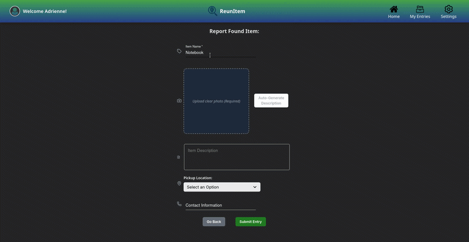
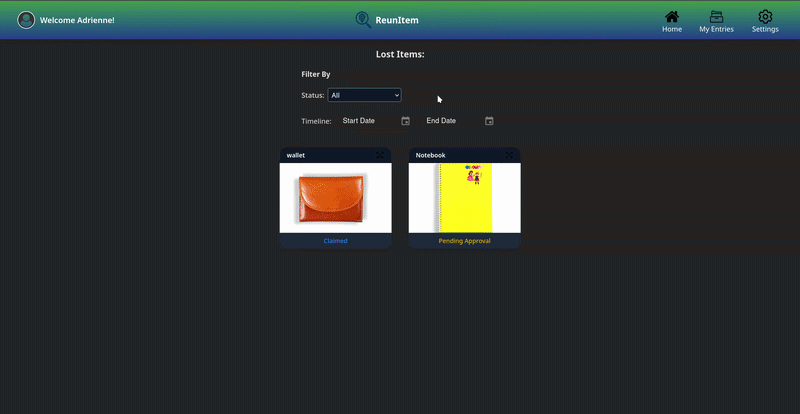

<p align="center">
  
</p>

# Reunitem 🔍

**Reunitem** is a smart lost-and-found management system designed to bridge the gap between missing items and their owners through AI-driven matching. Built primarily for school campuses and institutions, it empowers admins to moderate submissions and ensures user safety through verified meetups.

## 🚀 Key Features

* **Dual-Role Authentication**: Secure login for Users and Admins (Lost and Found Centers) using **JWT** (JSON Web Tokens—a compact way to securely send information between parties).
* **AI-Powered Matching**:
<div align="center">
  <table>
    <tr>
      <td align="center">
        <br />
        <b>AI Image Captioning</b>
      </td>
      <td align="center">
        <br />
        <b>Similarity Matching</b>
      </td>
    </tr>
  </table>
</div>
    * **Text Similarity**: Uses the `all-MiniLM-L6-v2` model to calculate similarity scores between lost and found item descriptions.
    * **Image Captioning**: Integrated `BLIP` (Bootstrapping Language-Image Pre-training) model to automatically generate descriptive text from uploaded photos.
* **Smart Filtering**: Matches are prioritized based on location, item category, and description accuracy.
* **Admin Dashboard**: Institutions can approve/reject submissions, monitor activity logs, and facilitate safe claims.
* **Security & Reliability**: Built-in system logging to monitor user activity and automated database backups.

## 🛠️ Technical Stack

* **Backend**: FastAPI (Python)
* **Database & Storage**: Supabase (PostgreSQL + S3-style bucket storage)
* **AI/ML**: Hugging Face Transformers (`BlipProcessor`, `Sentence-Transformers`)
* **Security**: JWT Authentication & System Logging

## ⚙️ How It Works

1.  **Submission**: A user reports a lost or found item. They can upload a photo, and the AI will automatically generate a detailed description to improve match accuracy.
2.  **Matching**: The system compares the new submission against existing reports using **Cosine Similarity** (a metric used to measure how similar two documents or descriptions are).
3.  **Verification**: Admins review the report for safety and authenticity.
4.  **Claiming**: If a match is found (e.g., an 85% match), the user is notified and can contact the other reporter or the admin to arrange a secure meetup.


## 🛠️ Installation & Setup

### Prerequisites
* Python 3.9+
* Supabase Account & Project API Keys

### Step-by-Step
1. **Clone the repository**:
   ```bash
   git clone https://github.com/yourusername/reunitem.git
   ```

2. **Set up virtual environment**:
   ```bash
   python3.11 -m venv .venv
   source venv/bin/activate  # On Windows: venv\Scripts\activate
   ```

3. **Install dependencies**:
   ```bash
   pip install -r requirements.txt
   ```

4. **Environment Variables**:
   Create a `.env` file and add your credentials:
   ```env
   SUPABASE_URL=your_supabase_url
   SUPABASE_KEY=your_supabase_anon_key
   JWT_SECRET=your_super_secret_code
   ```

5. **Run the server**:
   ```bash
   uvicorn app.main:app --reload
   ```

## 🛡️ Security & Monitoring
* **Logging**: All user actions (logins, submissions, claims) are recorded in a system log for audit trails.
* **Backups**: Automated backup cycles ensure data integrity within the Supabase ecosystem.
